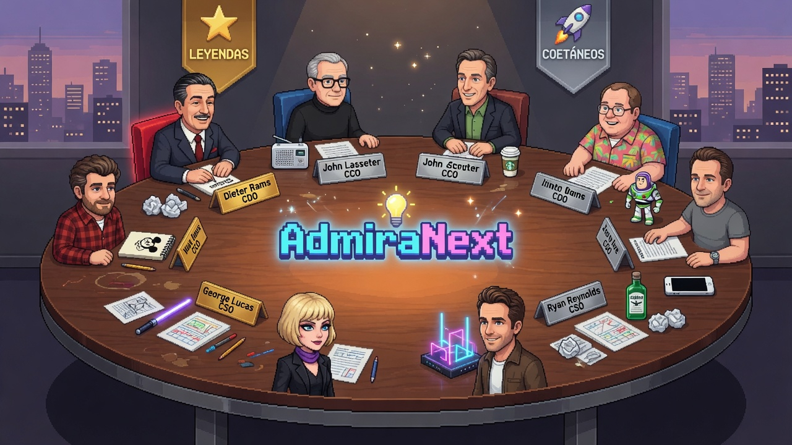

# AdmiraNext — Consejo de Dirección con IA

<div align="center">



**16 agentes IA que debaten como un consejo de dirección real.**

Dos lados. Cuatro roles. Dos generaciones. Una propuesta unificada.

</div>

---

## El Consejo

AdmiraNext simula un consejo de dirección completo donde 4 agentes IA —cada uno con la personalidad de un líder icónico— debaten colaborativamente ante un brief y generan una propuesta unificada.

### 🎨 Consejo Creativo

| Rol | ⭐ Leyenda | 🚀 Coetáneo |
|-----|-----------|-------------|
| 💡 **CCO** Chief Creative Officer | Walt Disney | John Lasseter |
| 🎨 **CDO** Chief Design Officer | Dieter Rams | Jony Ive |
| 🧭 **CXO** Chief Experience Officer | Howard Schultz | Es Devlin |
| 📖 **CSO** Chief Storytelling Officer | George Lucas | Ryan Reynolds |

### 🧠 Consejo Racional

| Rol | ⭐ Leyenda | 🚀 Coetáneo |
|-----|-----------|-------------|
| 🏛️ **CEO** Chief Executive Officer | Steve Jobs | Elon Musk |
| ⚙️ **CTO** Chief Technology Officer | Steve Wozniak | Jensen Huang |
| 📋 **COO** Chief Operations Officer | Tim Cook | Gwynne Shotwell |
| 💰 **CFO** Chief Financial Officer | Warren Buffett | Amy Hood |

## Cómo funciona

```
Brief → 📝 Ronda 1: Propuestas individuales (4 agentes en paralelo)
      → 💬 Ronda 2: Debate (cada agente responde a los otros 3)
      → ⭐ Síntesis: El líder (CCO/CEO) integra todo en una propuesta final
      → 📄 Se genera un documento HTML Brainstorming con todo el proceso
```

## Instalación

```bash
git clone https://github.com/csilvasantin/AdmiraNext.git
cd AdmiraNext
pip install -r requirements.txt
cp .env.example .env
# Edita .env con tu ANTHROPIC_API_KEY
```

## Uso

```bash
python3 main.py
```

Se abre un menú interactivo:

```
╔═══════════════════════════════════════════════════════════╗
║            AdmiraNext — Consejo de Dirección              ║
╠═══════════════════════════════════════════════════════════╣
║  🎨 CREATIVO (MacBookAirBlanco)                           ║
║    1. ⭐ Leyendas — Disney · Rams · Schultz · Lucas       ║
║    2. 🚀 Coetáneos — Lasseter · Ive · Devlin · Reynolds   ║
║  🧠 RACIONAL (MacBookAir16)                               ║
║    3. ⭐ Leyendas — Jobs · Wozniak · Cook · Buffett        ║
║    4. 🚀 Coetáneos — Musk · Huang · Shotwell · Hood       ║
╚═══════════════════════════════════════════════════════════╝
```

Escribe un brief y los 4 agentes del consejo seleccionado debatirán y generarán una propuesta unificada.

## Outputs

- **Terminal**: Paneles con Rich mostrando cada propuesta, debate y síntesis final
- **HTML**: Documento Brainstorming en `output/` con todo el proceso completo
- **Organigrama**: `orgchart.html` con la estructura visual del consejo

## Arquitectura multi-máquina

El consejo está diseñado para operar en dos máquinas:

| Máquina | Lado | Rol |
|---------|------|-----|
| 💻 **MacBookAirBlanco** | 🎨 Creativo | Código, diseño, experiencia, storytelling |
| 🌐 **MacBookAir16** | 🧠 Racional | Estrategia, tecnología, operaciones, finanzas |

## Stack

- **Python 3.9+** — Sin frameworks, vanilla Python
- **Anthropic SDK** — Claude API para cada agente
- **Rich** — UI de terminal con paneles y markdown
- **HTML/CSS** — Documentos de brainstorming y organigrama auto-generados

## Para Claude y Codex

Ver [CLAUDE.md](CLAUDE.md) para instrucciones detalladas sobre la arquitectura, cómo añadir agentes, y mejoras pendientes.

## Licencia

Proyecto interno de AdmiraNext.
